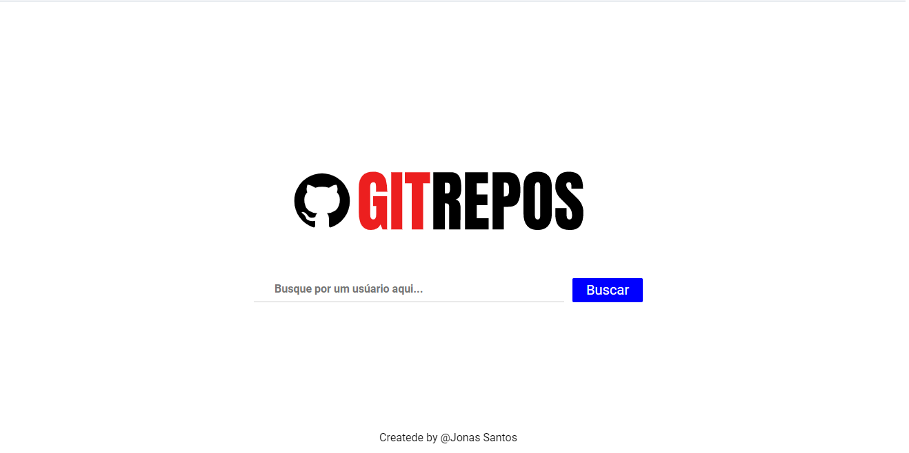
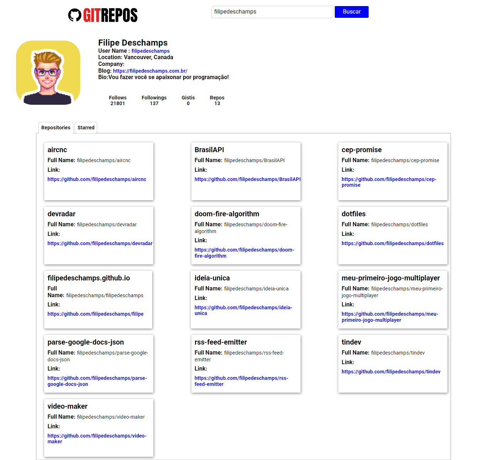

# GitRepos
### Projeto feito com *[ReactJS](https://pt-br.reactjs.org/docs/getting-started.html)* utilizando a API do github para busca de repositórios através do nome do usuário. Foi utilizado Axios para o consumo da API e Styled Components para a estilização. Cada componente tem uma única e exclusiva função, possibilitando a modificação tanto de estilo quanto a lógica envolvida, sem que a estrutura da aplicação sejá comprometida.
  

# Página Inicial

  

# Página de exibição

  

# Execução do projeto
### Primeiramente clone o repositório na sua máquina com o comando se
>*`git clone https://github.com/Jonas-sant/ProjetoReact-git-repos.git`*

### Agora com o terminal aberto na pasta do projeto execute o comando para instalar as dependencias
>*`npm install`*

### Feito isso agora é só rodar o projeto com o comando
 >*`npm start`*

  

# Dependencias
## - *[Axios](https://github.com/axios/axios)*
## - *[Styled-Components](https://github.com/styled-components/styled-components)*
## - *[React-Tabs](https://github.com/reactjs/react-tabs)*
